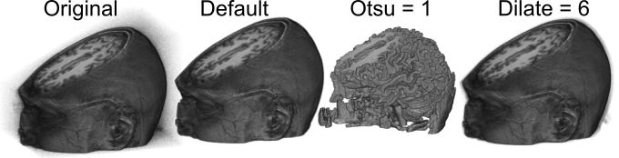
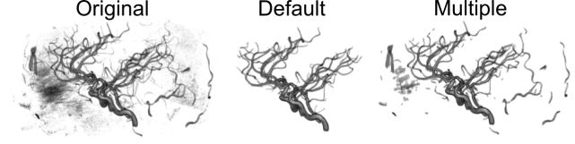
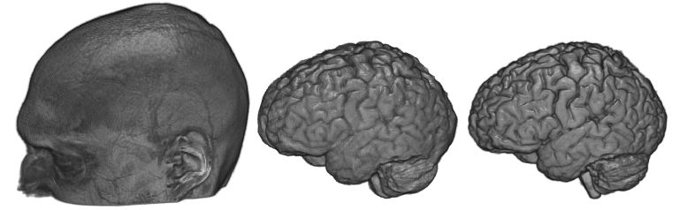

## MRIcroGL Object Extraction

Medical images are often noisy. In terms of volume rendering, noise in the air around an object can make the image appear a bit hazy. MRIcroGL’s “Extract Objects” command attempts to make all the air around an object transparent, providing a clear view of the object surface. To try this feature, simply load an image and choose “Extract Objects” from the “View” menu. You will be asked to specify a few options, but the default settings are usually pretty good. After a few seconds you will be shown the extracted object. Usually it is that simple. However, the images on this page show how adjusting the options for this command can tune the extraction process.

##### Otsu Levels

You are asked to specify a level of Otsu thresholding from 1..5, with the default value being 5. Large values lead to larger extracted objects. In the image below you can see what happens to an original image with the default Otsu level (5) versus an Otsu level of 1. I suggest starting with the default level, and if you are unhappy try re-opening your original image and running the extraction again with a smaller value. For those interested, this selection changes the number of levels specified by the Otsu threshold and the number of resulting levels treated as air: 1= 3/4, 2=2/3, 3= 1/2, 4=1/3, 5=1/4. In other words,selecting a level of 2 computes a threshold with 3levels of gray (e.g. each voxel will be classified as being one of three shades of gray: white, medium-gray, black) and assumes the darkest two compartments are air that should be transparent (e.g. the black and medium gray will both be set to transparent). With most medical images a default value of 5 is about right, for example with a T1-weighted MRI you can think of air, bone and water as black, gray matter as dark gray, white matter as light gray and the fat of the scalp as white: in this case we only want to remove the darkest tissue type. It should be noted that only external voxels are eliminated.

 
##### Edge Dilation

You can specify a number of voxels for dilation after the Otsu threshold. The default setting is 2, but you can choose a range of 0..12. One problem with the straight Otsu threshold is that it leaves sharp edges that can appear jagged. The problem is that many of the voxels on the surface of the object suffer from partial volume effects: in other words these voxels include a bit of the scalp and some air, but appear as dark as much of the noise seen in the air. Therefore, once we determine the edge of an object, it is often useful to grow the edge by a voxel or two to include some of these superficial voxels. Selecting a value of 0 often leads to a jagged looking volume rendering, while the “Dilate = 6” image above shows the consequence of choosing 6 voxels worth of dilation – note that there is a halo of noise around the object, as noisy air voxels are not attenuated near the scalp surface.

##### Single or multiple objects?

You are also allowed to select if there is only a single object in your image or if there are multiple objects. Many brain scans only include a single object (the head), and therefore only the largest single object is extracted by default. However, if your image is of multiple items you can choose to select each of these. The image below shows a Magnetic Resonance Angiography scan of the arterial blood supply to the head. Note that the original image is noisy. If one conducts the default object extraction, only the largest single object survives. The resulting extraction leaves the largest contiguous object: in this case the anterior, middle and posterior cerebral arteries. However, if one selects to extract multiple objects than several of the other arteries are preserved.

##### Brain extraction

Brain extraction is a special type of object extraction that attempts to remove signal from the scalp, providing an accurate representation of the gray matter and white matter. The image below shows a raw T1 scan (left image) and the extracted brain as detected using BET (middle image) and SPM8’s new segmentation (right image). There are several popular routines (see Shattuck et al. for a review) available. MRIcroGL for macOS and Linux has a command ‘Extract brain’ in the ‘view’ menu that calls FSL’s [BET](https://fsl.fmrib.ox.ac.uk/fsl/fslwiki/BET/UserGuide) (Brain Extraction Tool). This function requires that you have [FSL](https://fsl.fmrib.ox.ac.uk/fsl/fslwiki/FslInstallation) installed. You simply specify an extraction fraction (a value between zero and one, with smaller values leading to larger brain volume). BET usually works pretty well. However, it has problems if the image exhibits intensity inhomogeneity (an issue that can be fixed with [bias correction](https://pubmed.ncbi.nlm.nih.gov/20378467) ) or if the image includes too much neck (you can correct this by manually cropping the image with MRIcron). Another great alternative is using SPM’s unified segmentation normalization to detect gray and white matter. My [nii_nii2stl](https://github.com/rordenlab/spmScripts/blob/master/nii_nii2stl.m) script uses this approach. Unified segmentation has prior estimates for the location of gray and white matter, and includes a sophisticated bias correction. Further, my scripts feather the edges of the brain, making the edges appear less jagged (providing better estimates for [surface orientation](https://www.mccauslandcenter.sc.edu/mricrogl/shaders) ). This option typically works very well. The most common reason for problems is that SPM has a poor starting estimate – you can correct this by using SPM’s “Display” function to adjust the [origin to point to the anterior commissure](http://spect.yale.edu) .

Links
-------------------------------------------

 - Our object extraction method is similar to Dogdas et al. [(2008)](https://pubmed.ncbi.nlm.nih.gov/15966000) Hum Brain Mapp. 26: 273-85 (see their Figure 3).
 -  `Shattuck et al., [(20090](https://pubmed.ncbi.nlm.nih.gov/19073267) compare the performance of several different brain extraction techniques.
