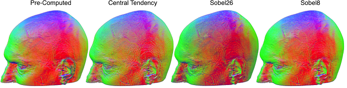

## MRIcroGL Gradients

Volumes appear more three dimensional if we make the top surfaces appear brighter than the bottom surface, emulating natural lighting. To do this we need to estimate the intensity gradients for our image. The [shaders page](https://www.mccauslandcenter.sc.edu/mricrogl/shaders) describes how gradients are used to create lighting cues, while this page describes optimized methods for calculating gradients.

##### Details

I like to visualize gradients by thinking of two bottles of salad dressing (illustrated on the right). One bottle has been allowed to settle for a long time, so there is a clear boundary between the oil and the denser vinegar. The other bottle was shaken recently, so while the oil is more concentrated at the top and the vinegar is more concentrated at the bottom, there is a gradual change of concentration between these two extremes. The gradients simply refer to the direction and rate of change of the concentrations. Both bottles have the same gradient direction: due to gravity the top has more oil than the bottom, we can think of this direction as an arrow (in 3D this is a vector with X,Y,Z components). However the two bottles have very different gradient magnitudes (the rate of change in concentration): most of the still bottle has very low gradient magnitudes with a disk of very strong gradients at the interface between the oil and vinegar. On the other hand, the perturbed bottle has weak gradients over a large region (as the concentration differs gradually over a large region).

Accurate gradient estimation is typically the most computationally intensive step for volume rendering. Therefore, it is important to consider how this stage can be accelerated to ensure interactive rendering.

There are two basic options: one can either pre-compute the gradients prior to rendering or you can calculate the gradients during the rendering.

The benefit for pre-computing the gradients is that we can use slow but precise algorithms for estimating the gradients (using both smoothing and Sobel filters). However, there are disadvantages for pre-computed gradients (section 9.4 of [Engel et al., 2006](http://www.real-time-volume-graphics.org) ). First, this typically requires twice the amount of memory on your video card (as we will have a volume for the image brightness and another that codes the gradient vectors and amplitudes). Second, the gradients to reduce memory demands the gradients are stored in low precision (typically 8-bits for each the X,Y,Z vector and the amplitude) which can lead to artifacts. Finally, the precomputed gradients are stored on a regular grid but we will be often sampling at locations locations between the grid centers (causing interpolation artifacts).

The downside with generating the gradients on the fly is that this can be slow, making interactive graphics difficult. As noted by [Engel et al. (2006)](http://www.real-time-volume-graphics.org) a classic Sobel filter requires 26 texture fetches, whereas the less accurate central tendency filter requires just six prefetches. Is there any way we can get the quality of the Sobel operator in a timely manner?
 - One option is to recognize that the [Sobel operator](https://en.wikipedia.org/wiki/Sobel_operator) is separable into a smoothing filter and a central tendency filter. Likewise, the resulting 3D components are separable and can often be processed one dimension at a time. [Apple](https://developer.apple.com/library/archive/documentation/Performance/Conceptual/OpenCL_MacProgGuide/TuningPerformanceOntheGPU/TuningPerformanceOntheGPU.html#//apple_ref/doc/uid/TP40008312-CH22-SW4) provides an excellent example for how this approach can be optimized. Unfortunately, this separability is not suitable for generating gradients on the fly (as the fragment shader must work in a single pass). Therefore, these tricks can only be used for pre-computed gradients (where speed is usually not crucial, and where they are still unlikely to outperform the GPU-based techniques described next).

A second approach to accelerating the Sobel operator is to take advantage of the fact that our graphics card computes trilinear interpolation in hardware. Therefore, if we sample a location that is not precisely on our grid we will get a weighted average for all 8 neighboring voxels. Since this is done in hardware, it is exceptionally fast (indeed, for our volume rendering will rarely precisely sample the grid, so even the central tendency filter relies on the efficiency of this trilinear sampling). Therefore, while the classic Sobel operator requires us to get the weighted average of 26 voxel locations (requiring both texture perfecting and multiplication to apply the weighting coefficients). This allows us to mimic a Sobel filter with just 8 texture reads. [Sigg and Hadwiger](https://developer.nvidia.com/gpugems/gpugems2/part-iii-high-quality-rendering/chapter-20-fast-third-order-texture-filtering) are the definitive description of this approach for hardware accelerated convolution, including gradient estimation (section 20.4). For the Sobel operator, we merely need to read the eight image points that are directly between the target voxel and the neighbors that share a corner. In other word, we sample each permutation of (X+/-0.5, Y+/-0.5, Z+/-0.5). To see why this works, consider the voxel directly above our target voxel (the voxel that shares a face with our target): it is 0.7 voxels away from all four top corners, whereas the four top voxels that share an edge are 0.7 voxels away from two of the corners. Finally, the four top voxels that share a corner with our target are 0.7 voxels away from the one of the corners. This perfectly matches the weighting required by the Sobel operator: so we not only reduce the number of texture fetches but also the scaling coefficients.

You can see that the pre-computed gradients look really nice – these benefit from a careful smoothing algorithm. You can also see that the central tendency edges look pretty hard relative to the conventional Sobel (Sobel26) and our interpolated Sobel (Sobel8). In terms of frame rate (using a very large volume and my laptops’ integrated Intel GPU), I observed that the pre-computed refreshed at 29.2fps (2 texture fetches), central difference 28.3fps (7), sobel8 28.0fps (9), classic sobel26 19.5fps (27).

If you look carefully you will see that the Sobel8 actually seems to look better than the traditional Sobel26. How can this be? By default I have set this filter to sample a bit further away from the target. You can see the influence of sampling distance by adjusting the “sampleDistance” slider. Note that to mimic a traditional Sobel26 you would sample 0.5 voxels in each dimension from the voxel center, whereas by default I am sampling 1.0 voxel away (in theory precisely at the location of the corner voxels, but remember that our sampling is not constrained to the grid). You can try adjusting the sampling distance for each of the filters to see the effect. My default setting emulates a Sobel with a slightly larger kernel (at 0.5 the center voxels are sampled by both the top and bottom points, canceling each other out, with a larger separation we are getting unique information from more distant voxels). Obviously, large values will lead to smoothing that can miss details, but also attenuates high frequency noisy. A value of about 1.0 seems about right, and note that even with larger sampling distances the Central Distance operator does not look as good as the Sobel8.

All of these shaders use one extra trick: they [reuse gradient normals](https://www.marcusbannerman.co.uk/articles/VolumeRendering.html) . You can see the influence by checking the reuseGradients check box. The basic idea here is that our estimates of gradient vector directions can be noisy. Therefore, if our current gradient magnitude is lower than our previous estimate we will use the vectors from the prior estimate. Notice that this trick especially helps the pre-computed gradients, directly addressing the criticism of pre-computed gradients described by [Engel (e.g. their Figure 9.17)](http://www.real-time-volume-graphics.org).

Since the GLSL shaders are simply text files, you can edit them to try new effects. For example I also include Sobel14 which essentially combines the Sobel8 and Central Difference (sampling a sphere of locations both aligned to the faces and corners of the target voxel). I also include an even faster version of the central difference that [compares just three locations](https://prideout.net/blog/?tag=volume-rendering) to sampled target voxel, note that this introduces a slight spatial bias but it is exceptionally fast.

##### Links

 - [Engel et al.’s](http://www.real-time-volume-graphics.org) book Real-Time Volume Graphics remains an outstanding introduction to the topic.
 - [Sigg and Hadwiger’s](https://developer.nvidia.com/gpugems/gpugems2/part-iii-high-quality-rendering/chapter-20-fast-third-order-texture-filtering) chapter in the book GPU Gems 2 is the seminal reference for the techniques discussed here.
 - Numerous web pages describe how to optimize the common Gaussian blur filter for the GPU. These are useful if you wish to precompute yourgradients by separating the Sobel operator into a blur stepfollowed by central tendency. Some of the best pages are from [Eric](https://www.realtimerendering.com/blog/quick-gaussian-filtering/), [Brad](http://www.sunsetlakesoftware.com/2013/10/21/optimizing-gaussian-blurs-mobile-gpu) , and [Daniel](https://rastergrid.com/blog/2010/09/efficient-gaussian-blur-with-linear-sampling/). Alternatives are provided by [Fabian](https://fgiesen.wordpress.com/2012/08/01/fast-blurs-2/) (useful for CPUs where you do not have hardware accelerated interpolation) and the approximation from [Apple Computers](https://developer.apple.com/library/archive/documentation/Performance/Conceptual/OpenCL_MacProgGuide/TuningPerformanceOntheGPU/TuningPerformanceOntheGPU.html#//apple_ref/doc/uid/TP40008312-CH22-SW4) .
 - [Ruijters et al. (2009)](https://www.tandfonline.com/doi/abs/10.1080/2151237X.2008.10129269) further refine Sigg and Hadwiger’s algorithm removing the need to pre-compute lookup tables.

 
