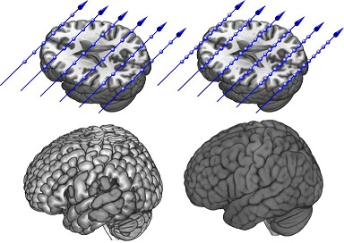
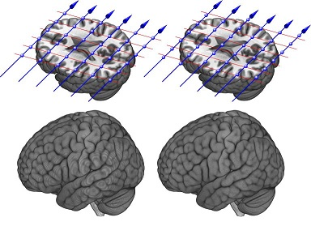
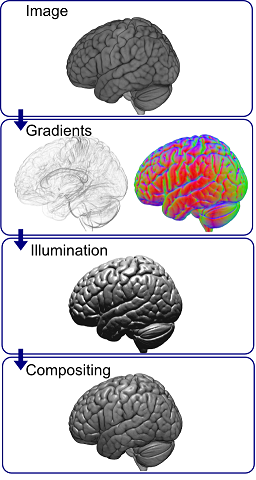
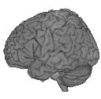
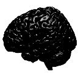
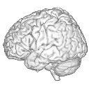
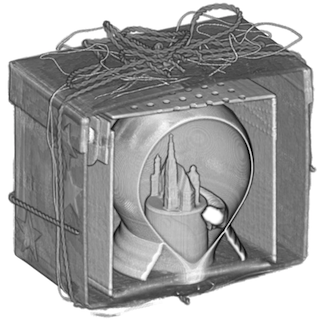

## MRIcroGL Shaders

This page describes [MRIcroGL](https://www.nitrc.org/plugins/mwiki/index.php/mricrogl:MainPage) shaders. Shaders are programs designed to run on a graphics card. 

##### Basic Volume Ray Casting

MRIcroGL uses a technique called [volume ray casting](https://en.wikipedia.org/wiki/Volume_ray_casting) to generate images. For every pixel on your computer screen, a ray is fired through the 3D image, with the 3D image sampled at regular intervals along the ray’s path. The picture on the right illustrates this process. Note that the ray accumulates the color as it traverses the volume. Regions of air are transparent, and therefore the ray does not accumulate any color or opacity. However, when it strikes tissue it starts to absorb both color and opacity. However, the ray’s ability to gain color is negatively related to its opacity. In other words, initial tissue near the surface of the object greatly influences the final color, whereas subsequent tissue has little effect. This mimics the real world, where light is absorbed by surface tissue, and therefore reflected light is primarily influenced by regions near an object’s surface. One important decision is how often the volume is sampled by the ray (the ‘step size’): fewer samples leads to faster rendering, but can make the surface of the object appear jagged. This is illustrated in the figure, where the left image shows the result of very few samples, while the right image shows a very fine sampling distance. MRIcroGL provides a slider named “Quality” that allows the user to adjust the sampling rate, trading-off speed and quality.

As noted, one artifact of large step sizes is that surfaces canappear jagged, leading to a ‘wood grain’ effect of the image. However, ‘stochastic jitter’ (also known as ray dithering) is a simple technique that can dramatically reduce this with very little influence on processing speed. The basic idea is to randomly adjust the starting depth of each ray. Therefore, neighboring rays are not sampling along precisely the same depth. Therefore, the coherence of the large step sizes vanishes. This is illustrated in the images on the right. The left column shows a large step size without stochastic jittering. Note that all the rays sample at precisely the same depths (illustrated by the red line), and the resulting rendering (bottom left) shows aliasing artefacts. The right column shows precisely the same sampling rate, but the initial depth of each ray is jittered – the resulting image looks much more realistic.

 
##### Shading and special effects

Volume rendering can be enhanced by shading and illumination – providing the viewer with hints about the three dimensional shape of an object. For example, on a sunny day an apple appears brighter and shinier on the top than the bottom. This illumnation depends on the location of the light source (the sun) and the orientation of the objects surface. To simulate this with a computer, we need to work out the objects surface (e.g. the edges). Typical surface rendering techniques assume edges are always sharp and distinct – there is a sharp boundary between the edge of the apple and the air around it. However, with volume rendering we typically treat edges as more gradual, for example the gradual transition from oil to vinegar in a bottle of salad dressing. Treating surfaces as gradual is logical for gasses and liquids, but interestingly making this assumption often leads to more realistic looking renderings of the the human body. The reason for this is that our flesh is actually translucent, and therefore our appearance is based not just on the color of our skin, but the blood and other tissues underneath. In image processing, we use [image intensity gradients](https://en.wikipedia.org/wiki/Image_gradient) to describe surfaces that can be either discrete or gradual transitions. In general, the term gradient refers to a change from one intensity to another: in hiking a slope is an altitude gradient. For images, a gradient is a region where the brightness changes. To understand this in terms of volume rendering, consider to the two bottles of salad dressing shown on the upper right – each three parts olive oil and one part balsamic vinegar. Vinegar is heavier than olive oil, so due to gravity it has a stronger concentration at the bottom of each bottle. However, the bottle on the left has been left undisturbed for a long time, whereas the bottle on the right has been recently agitated. Therefore, the boundary between the two liquids is very dramatic on the left relative to on the right. The gradient is simply the rate of change in concentration. The bottom row illustrates the gradients for these two situations: the bottle on the left has a very narrow gradient with a high magnitude (shown as a thin white band), whereas the bottle on the right has a much larger but weaker gradient (a broad dark gray band). While the size and magnitude of these gradients differ, the gradient direction does not: in both cases the oil is above the vinegar (shown by the red arrow). If you want to know more about how gradients, see my dedicated [page](https://www.mccauslandcenter.sc.edu/mricrogl/gradients).

The image on the right shows how gradients are used to generate illumination effects with MRIcroGL. The top picture (‘Image’) shows the volume rendering of our image (generated by volume ray casting): here dark regions correspond to darker tissue in the image only (the location of the illumination source has no influence). The second panel (‘gradients’) shows the gradient magnitudes (regions where the image brightness changes) and the corresponding gradient directions (for easy illustration red, green, and blue correspond to left/right, front/back, top/bottom; though note in reality our gradients also store polarity: left and right are ‘positive’ red and ‘negative’ red). We can use the gradient directions to compute the specular and diffuse lighting, as shown in the ‘Illumination’ panel. Our final image typically blends information from both the ‘image’ and the ‘illumination’ (‘[Compositing](https://en.wikipedia.org/wiki/Compositing)‘).

##### Using shaders in MRIcroGL

MRIcroGL includes text files in a folder called ‘shaders’ (for macOS users, you will have to select the application and choose ‘show package contents’ to see this folder). When MRIcroGL starts, it loads these into the ‘Shaders’ pulldown menu. This allows the user to choose between the installed shaders and also allows you to adjust the settings for many of these programs. Power users can edit the shader text files to create unique effects. The shader minimal.txt shows how a shader can be created with less than 50 lines of code. Here are some useful hints:

 - MRIcroGL chooses the initial default shader based on alphabetically sorted filenames. So if you prefer the ‘phong.txt’ shader to ‘basic.txt’, you could simply rename it ‘aphong.txt’.
 - Most shader text files start with a ‘pref’ section that provides the user with adjustable values. You can easily edit these to make the default shader settings more to your liking. For example, the basic.txt shader has a preference lightAmount|float|0.0|0.2|1 – which means that the user will see a slider that allows them to adjust the amount of light from 0 to 100%, with a starting point of 20% (the first number is the minimum, the second is the default, the third is the maximum). If you prefer more lighting hints, you could edit the middle number, e.g. if you prefer 50% light you would set this to lightAmount|float|0.0|0.5|1
 - You can copy shader files and give each a different file name, this would allow you to set custom preferences.
 - You can adjust MRIcroGL’s ini file to set default shader settings: RayCastQuality1to10 allows you to choose the quality of raycasting from 1 (fast but poor quality) to 10 (slow but excellent quality). Changing RayCastViewCenteredLight=0 will have the lighting specified relative to the object, not the viewer.

| Appearance             |  Effect: Description |
:-------------------------:|:-------------------------:
  |  Volume: Brightness depends on image intensity. 
  |  Ambient: General brightness regardless of other properties.
  |  Diffuse: Illumination ofdull surfaces. Angle of surface relative to light source.
  |  Specular: Mirror reflection from shiny smooth surfaces. Angle of surface and eye position relative to light. 
  |  Edge: Surfaces parallel to line-of-sigh are darker. 
  |  Volume: Brightness depends on image intensity. 

##### Advanced notes

 - The book [Real-Time Volume Graphics](http://www.real-time-volume-graphics.org) is a great resource for learning about hardware-accelerated volume rendering. However, that this resource primarily focus on Texture-Slicing methods, whereas MRIcroGL employs volume raycasting (which was still pretty uncommon in 2005).
 - MRIcroGL uses [GLSL](http://mew.cx/glsl_quickref.pdf) plugins to create effects. You can edit these text files to create interesting shading and illumination effects. Here are some web pages that describe the techniques used by MRIcroGL: [Marcus Bannerman](https://www.marcusbannerman.co.uk/articles/VolumeRendering.html) describes optimizations, [Ellenberger and Nowak](http://pages.cs.wisc.edu/~nowak/779/779ClassProject.html) implementnice GLSL effects, [Voreen](https://www.uni-muenster.de/Voreen/) is an outstanding open-source GLSL volume rendering package, [Philip Rideout](https://prideout.net/blog/old/blog/index.html@p=64.html) have simple code illustrating GLSL volume rendering, MRIcroGL computes surface angle ('gradients') based on [Sobel filtering](https://en.wikipedia.org/wiki/Sobel_operator) , Kyle Hayward wrote a [series of blogs](https://graphicsrunner.blogspot.com/2010/05/volume-rendering-202-shadows-and.html) describing volume rendering techniques.
 

 

