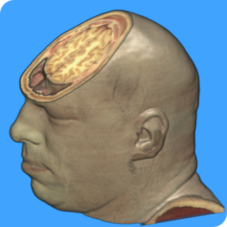
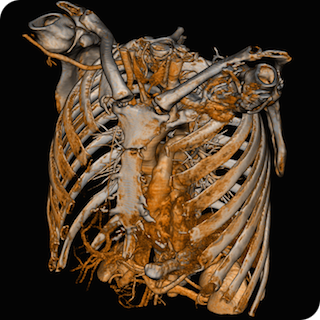

## MRIcroGL Troubleshooting

This page describes how to resolve issues with [MRIcroGL](https://www.nitrc.org/plugins/mwiki/index.php/mricrogl:MainPage). This page wwas originally created several years ago, at a time when graphics cards were generally less poserful. Most modern computers should support this software without issue.

 - MRIcroGL requires a graphics card and driver that can support large 3D textures. It will not run on all computers, and it will run slowly on older computers. The framerates are interactive for all modern computers (e.g. even the integrated Intel Sandy Bridge GPUs released in 2011 provide good speed, whereas modern GeForce and Radeon cards are much faster).
 - MRIcroGL requires OpenGL version 2.1 (released in 2006) or later.
 - To reset the default settings, hold down the ‘shift’ key when you launch the program (or the ‘control’ key if you are using Linux).

##### Windows 

 - MRIcroGL works well with virtually all modern GeForce and Radeon cardsin Windows. It also works with the integrated graphics built into modern (since 2011) AMD and Intel CPUs. 
 - User preferences are saved as an '.ini' file. As long as you have write permission, this file is saved in the same folder as the application, otherwise it is saved in the user's preferences folder. To open this file, choose the "Preferences" menu item and click on the "Advanced" button.

#####  Linux

 - MRIcroGL works fine with modern GeForce graphics cards (I suggest using the Nvidia drivers, as of 2015 the Nouveau drivers are slow and sometimes suffer artifacts). The current (2015) AMD Radeon graphics drivers for Linux also work well. Intel drivers appear to support volumes up to 256 voxels in any dimension. See the [troubleshooting](https://www.mccauslandcenter.sc.edu/mricrogl/troubleshooting) page if you have problems.
 - User preferences are stored in a hidden folder in the user's directory (~/.MRIcroGL/mricrogl.ini).To open this file, choose the "Preferences" menu item and click on the "Advanced" button.

##### macOS Macintosh

 - MRIcroGL requires an Intel-based Macintosh with macOS 10.4 or later.
 - Computers with Intel-based graphics cards (some MacBooks, MacBook Airs, Mac Minis) may have problems if they are running macOS 10.6.7-10.7, though they will run with 10.6.6 or earlier and 10.8 and later. 
 - With macOS 10.9 and later you may need to allow this program to run using using the (Security & Privacy System Preferences](https://support.apple.com/en-us/HT202491) . 
 - User preferences are stored in a hidden folder in the user's directory (~/.MRIcroGL/mricrogl.ini).To open this file, choose the "Preferences" menu item and click on the "Advanced" button. 

##### Setting Graphics Quality

If you experience probelms with MRIcroGL, start the program while depressing the SHIFT key (or Control if you are using Linux). You will be asked if you want to reset the program to the default settings – press ‘Yes’. This restores the generic settings for the program.

By default, MRIcroGL attempts to show the images in their native resolution. However, this strategy may not work well in two situations: with older video cards the rendering may be very slow, whereas with video cards with little texture memory the images may appear scrambled. To combat either effect, launch MRIcroGL with while holding the shift key down (or control key if you are using Linux). A dialog will appear asking you if you wish to restore the default settings – press “Yes”. Next, a dialog appears ‘Set graphics card (0 = old, 1 = poor, 2 = OK, 3 = great’, providing you with four options:

 - Enter ‘0’ if you have an old video card (e.g. iMac or MacBook from 2006 or earlier). In this case, the images will be padded to the nearest power-of-two (e.g. an image with a dimension of 217 voxels will be converted to have 256 voxels). Images should still appear ‘Normal’. This selection improves rendering speed on old hardware, but slows rendering speed on modern hardware. To test rendering speed, choose the ‘About MRIcroGL’ menu item – the loaded image will be rotated 360-degrees and the frames per second reported. Therefore, you can test the speed with and without data padding.
 - Enter ‘1’ for reduced resolution. This will reduce the maximum dimension of any image to 88 voxels. The software should work, but image quality will suffer (see ‘Shrunk’ image). This is required for macOS computers with Intel graphics cards running macOS versions after 10.6.6 and before 10.8.
 - Enter ‘2’ for standard resolution (256 voxels in each dimension). This should work with most graphics cards (including Sandy Bridge or later Intel Graphics cards). The maximum resolution is set to 256 voxels in each dimension. Images should appear ‘Normal’, but if they appear ‘Scrambled’ restart the software with the shift key down and select a smaller number.
 - Enter ‘3’ for great resolution (2048 voxels in each dimension). This provides the best performance for modern video cards with adequate texture memory. Images should appear ‘Normal’, but if they appear ‘Scrambled’ restart the software with the shift key down and select a smaller number.

Finally, a dialog appears ‘Set gradient calculation (0=slow[CPU], 1=fast[GPU])’, providing you with two options:

 - Enter ‘0’ to use the central processing unit to estimate gradients. This will tend to lead to slow loading of images. Use this only if the fast option causes your computer to crash when loading images. You will want to set this option if you see the error message “Access violation at address 00000000” when the application launches (NVidia video cards from 2009 or earlier running 32-bit Windows XP).
 - Enter ‘1’ to use the graphics card to estimate gradients. For most computers this is the preferred option. The only reason not to use this is if you have a very old graphics card with very little memory for graphics.

##### Virtualized Environments

MRIcroGL can run on some virtualized systems using the right versions of VirtualBox (including with 'Enable 3D acceleration'), Mesa (Mesa (version [7.6](https://www.omgubuntu.co.uk/2017/11/install-mesa-17-2-ubuntu), check using glxinfo) and VirtualGL (vglrun). MacOS and Linux users can type 'glxinfo' at the command line for details about your OpenGL support: glxinfo should report "OpenGL version string: 2.1" (or later). Further, the glxinfo Visuals Table should report Red (r), Green (g), blue (b) of at least 8-bits each and a depth (dpth) of at least 24 bits. Linux users who do not meet these requirements will may see the error message 'gdk_gl_context_share_new_usefpglx context creation failed' when they attempt to run MRIcroGL. You can remedy this by upgrading your graphics driver or hardware.

If your virtualized environment uses X11, be aware that X11's indirect rendering mode is limited to OpenGL 1.4 and earlier. Since MRIcroGL requires OpenGL 2.1, you will need to use direct rendering. SCM provides a [terrific page](https://www.scm.com/doc/Installation/Remote_GUI.html) describing the options for running modern OpenGL on remote machines.

##### Advanced Notes

- MacBooks, MacBook Airs and Mac Minis that use the [Intel HD 3000 Graphics](https://support.apple.com/en-us/HT204349) will work correctly in standard mode with macOS 10.6.6 and earlier or 10.8 and later. However, the drivers for intermediate versions of macOS (10.6.7-10.7) require reduced resolution. I remain puzzled why the volumes are limited to around 88^3 (just ~2.6Mb for a RGBA texture).
- You can also manually adjust these values by editing your MRIcroGL.ini file with a text editor. For Windows, this is stored in the same folder as the executable, for macOS/Linux it is in the hidden folder ~/.mricrogl.
- ForcePowerOfTwo=0 : Determines whether image is padded to a power of two (1) or not (0). Default is 0.
- MaxVox=2048 : Sets the maximum resolution loaded: default is 2048, reduced resolution is 88. Note that this is typically used with ForcePowerOfTwo=0, if you set ForcePowerOfTwo=1, then it is strongly suggested you set MaxVol to a power of two (64, 128, 256…).
- RayCastQuality1to10=4 : Determines sampling rate of each ray. A value of 1 leads to very coarse surfaces (but quick rendering), while a value of 10 leads to precise surfaces (but slow rendering). The value of 4 is the default, but this is adjusted to 8 with reduced resolution (i.e. with a MaxVox of 88, the volumes are very small, so there is little penalty for a fine sampling rate).

- Power users can can also use the “MaxVox” setting to tune MRIcroGL’s performance for their video card. For example, consider the MNI152_T1_0.5mm image that is distributed with FSL: it has ~5 times more voxels than the ch256 image that ships with MRIcroGL. This huge image may render acceptably on a high end video card, but be very sluggish on a laptop video card. In this case, one might consider setting the laptop for “MaxVox=256”: subsequently the really large MNI152_T1_0.5mm image with 364*436*364 voxels will be interpolated to 214*256*214, and will render with similar speed as the ch256 image. In this case, images with resolutions less than 256 voxels will not be influenced, and while the loading of images above this resolution will be slow (as the image is resliced) the subsequent performance will be fast.
- Debian-based (e.g. Ubuntu) Linux users may see the followng message in the terminal command line 'Gtk-Message: 11:29:20.110: Failed to load module "canberra-gtk-module"'. Feel free to ignore this message. However, if you want you can 'runsudo apt install libcanberra-gtk-m'. This library enables auditory effects for using the graphical interface, e.g. so you can hear a 'click' sound when a button is depressed. It is completely optional.
- Linux users where glxinfo reveals they are using Mesa may find that they can use the launch the software from the command line with an [override](https://askubuntu.com/questions/850900/why-is-my-opengl-version-stuck-at-3-0-despite-new-hardware-software) , e.g.``MESA_GL_VERSION_OVERRIDE=3.3 MRIcroGL`` 
- See the [NITRC MRIcroGL Wiki](https://www.nitrc.org/plugins/mwiki/index.php/mricrogl:MainPage) for additonal tips.
