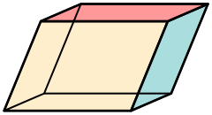

# Converting Voxels to World Space
The [NIfTI](https://brainder.org/2012/09/23/the-nifti-file-format/) format is used by many scientific tools for medical images like MRI and CT scans. The NIfTI format is simpler than the DICOM format used by medical devices. This simplicity explains its popularity, despite potential benefits for the [DICOM ](http://qiicr.org/dicom4miccai/dicom4miccai2017.html) format. One source of confusion regarding NIfTI is how to convert data from voxel space (rows, columns and slices of the image) to world space (the left/right, anterior/posterior and inferior/superior dimensions of the participant). 

Surprisingly, the NIfTI header contains [two independent transforms](https://nifti.nimh.nih.gov/nifti-1/documentation/nifti1fields/nifti1fields_pages/qsform.html) for converting between voxel and world space: the QForm and the SForm. These do not necessarily need to be identical. For example, the QForm might encode the location of the patient with respect to the MRI scanner that acquired the data, while the SForm might encode the normalized position of the brain, roughly matching the size and shape of [a standard atlas](https://www.ncbi.nlm.nih.gov/pmc/articles/PMC4324755/). Unfortunately, providing two methods can lead to confusion, specifically when the SForm and QForm encode different spatial transforms. Some tools (e.g. MRIcroGL, SPM) give precedence to the SForm, but ITK-based tools (Slicer 3D, ANTS, etc.) give precedence to the QForm. Therefore, an image might appear to have very different alignment based on the tool used.

The QForm uses a [Quaternion](https://en.wikipedia.org/wiki/Quaternion) to store an orthogonal transform with 9 degrees of freedom (zoom, rotation and translation in each of the 3 spatial dimensions). 
On the other hand, the SForm uses a [spatial transformation matrix](https://en.wikipedia.org/wiki/Transformation_matrix) to store an [affine transform](https://en.wikipedia.org/wiki/Affine_transformation) with 12 degrees of freedom (zoom, rotation, translation, and shear in each of the 3 spatial dimensions). Therefore, any quaternion can be losslessly stored and a matrix, but the reverse is not true. One must consider this when using the functions [nifti_mat44_to_quatern and nifti_quatern_to_mat44](https://nifti.nimh.nih.gov/pub/dist/src/niftilib/nifti1_io.h) to convert between these two forms.

Therefore, quaternions are inherently more constrained than matrices and less intuitive. Their popularity stems from their efficiency in storage and computation. Mathematically, it is simple to smoothly interpolate between two different quaterions, for example animating intermediate positions between a defined starting and ending position. Further, their constrained nature can be seen as a benefit. Since they are unable to store shearing effects, one does not need to worry about rounding errors accumulating to deform a rectangular volume.

Raw MRI scans are always acquired as rectangular boxes, so they can encode native space losslessly with a QForm. This is not the case for CT scans, where a gantry tilt is often applied. This generates a rhomboidal volume. These [parallelepiped](https://en.wikipedia.org/wiki/Parallelepiped) volumes can not be encoded with a QForm, though they can be stored as a SForm. Many tools are unable to represent non-rectangular volumes. This explains why dcm2niix will convert DICOM images to interpolated NIfTI rectangular volumes (adding the [_Tilt](https://github.com/rordenlab/dcm2niix/blob/master/FILENAMING.md) post-fix).

# Links

 - [dcm2niix gantry tilt](https://github.com/rordenlab/dcm2niix/issues/253)
 - [DICOM CT scans](https://www.nitrc.org/plugins/mwiki/index.php/dcm2nii:MainPage#Computed_Tomography_.28CT.2C_CAT.29) exhibiting gantry tilt.
 
 
 [Home Page](../README.md)

